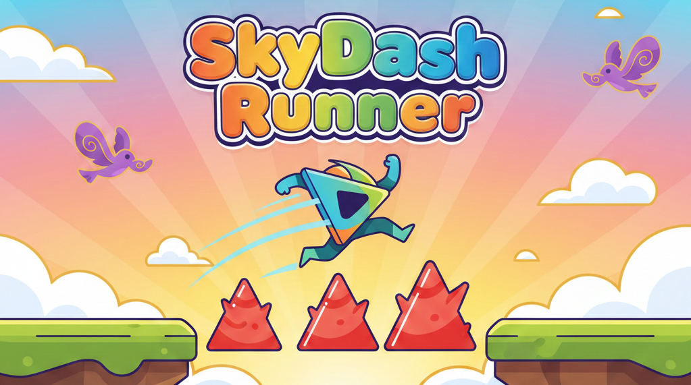

# 🌟 SkyDash Runner

  <!-- Optional: Add a banner image -->

---

## 🎮 Game Description

**SkyDash Runner** is an endless runner game built with Python `tkinter` and `pygame` for background music.  
You control a small triangular character racing across the ground, jumping over barriers and avoiding flying obstacles.  
The game speeds up gradually as you score more points, making it increasingly challenging and fun!

---

## 🕹 How to Play

- Press **SPACE** to make the player jump.  
- Avoid **barriers** and **flying birds**.  
- The game gets faster every **500 meters** (or points).  
- Your score increases continuously as you run.  
- Game over occurs if you collide with any obstacle.  

---

## ✨ Features

- Triangle player character with animated legs.  
- Barriers and birds as obstacles.  
- Smooth jumping physics and gravity.  
- Gradient backgrounds and buttons for a polished look.  
- Background music that loops during gameplay (volume set to 20%).  
- Speed increases every 500 points for extra challenge.  
- Start screen and credits page for **Ritesh Verma**.  

---

## 🛠 Technologies Used

- Python 3  
- Tkinter (GUI)  
- Pygame (for background music)  

---

## 📂 Installation

##--Soon--##
